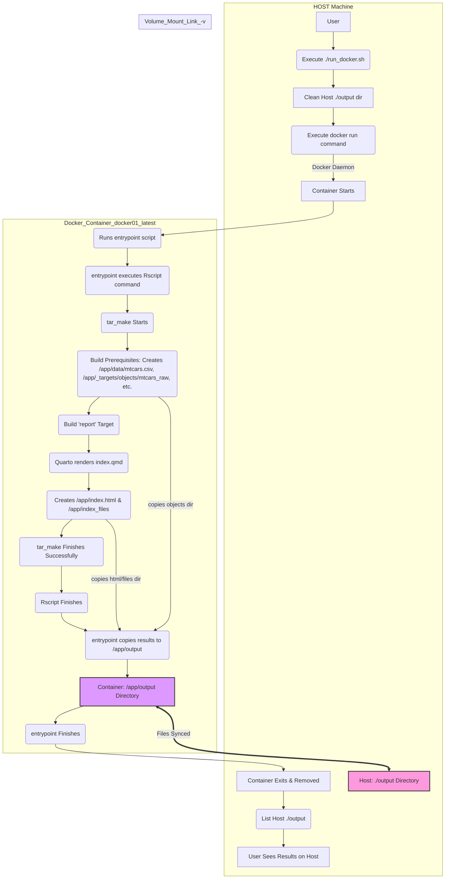

# docker01

This project uses Docker to create a self-contained, reproducible environment for running the analysis pipeline. The pipeline was created via the `targets` and `tarchetypes` packages.

## About

A container is a standard unit of software that packages up code and all its dependencies so the application runs reliably from one computing environment to another. Software containers standardize the description and creation of a complete software system: you can drop a container into any computer with the container software installed (the ‘container host’), and it should just work. Containers are an example of what’s called virtualization – having a second virtual computer running and accessible from a main or host computer. Docker is a tool that allows you to build and run containers. It’s not the only tool that can create containers, but is the one we’ve chosen for this workshop. While the container is an alternative filesystem layer that you can access and run from your computer, the container image is the ‘recipe’ or template for a container. The technical name for the contents of a Docker Hub page is a “repository.”  Building an image is similar to the `install.packages()` function in R, and running the image is akin to `library()`.  The Docker Hub is an online repository of container images.


## Commands

Some common commands are:

```bash
docker --version
docker container ls
docker --help
docker container --help
docker image ls
docker image pull hello-world
docker container run hello-world
docker container run -it alpine sh
docker image pull python:3.8
```

## Installation 

Follow these steps to build the environment and generate the report:

**1. Prerequisites:**

-  **Docker:** You need Docker installed and **running** on your system. Docker Desktop is recommended for Mac and Windows. Download from [https://www.docker.com/products/docker-desktop/](https://www.docker.com/products/docker-desktop/). (For Linux, follow standard Docker Engine installation instructions).

-  **Git:** You need Git to clone the repository. Download from [https://git-scm.com/](https://git-scm.com/).

**2. Clone the Repository:**

Open your terminal or command prompt and clone this repository to your local machine. Replace `<YOUR_REPOSITORY_URL_HERE>` with the actual URL.

```bash
git clone <YOUR_REPOSITORY_URL_HERE>
cd <REPOSITORY_DIRECTORY_NAME> # Replace with the name of the cloned folder

```
**3. Build the Docker Image:**

Navigate into the cloned project directory in your terminal. Build the Docker image using the provided Dockerfile. This command creates an image named docker01 containing R, Quarto CLI, all necessary R packages (via renv), project-specific R functions, static assets, citation files, and system dependencies needed to run the pipeline.

```bash
docker build -t docker01 .
``` 

(Note: This step might take several minutes the first time you run it, as it needs to download the base R image and install dependencies. Subsequent builds will usually be much faster due to Docker's caching.)

**4. Run the Analysis Pipeline:**

Execute the provided shell script. This script will start a Docker container from the docker01 image, run the targets pipeline inside it (which downloads data, creates plot objects, and renders the index.qmd Quarto report using the included assets and citations), and copy the final output back to your local machine.

```bash
./run_docker.sh
```

You will see output messages from the R session and the targets pipeline running inside the container.

**5. View the Output:**

Once the ./run_docker.sh script completes successfully, the final rendered report (index.html) and any supporting files (like images in index_files/) will be located in the output/ directory within your project folder on your local machine. The script might automatically attempt to open output/index.html in your default web browser (this works on macOS with the open command).

If it doesn't open automatically, you can manually navigate to the output folder in your file explorer and double-click index.html, or use the terminal command (while in the project root): open output/index.html (on macOS) or equivalent for your OS.

That's it! Following these steps ensures that the analysis is run within the specific, controlled environment defined by the Dockerfile, making the results reproducible.

## Workflow

### Flowchart



### Description

1. Host Machine: You start everything by running the ./run_docker.sh script. This script first cleans up any old results in the local ./output directory. Then, it uses the docker run command to tell the Docker daemon to start your container. Critically, docker run sets up the volume mount, linking the host's ./output to the container's /app/output.

2. Docker Container: Once the container starts, its designated entrypoint (/entrypoint.sh) automatically runs.

3. Pipeline Execution: The entrypoint.sh script executes your targets pipeline using Rscript. targets::tar_make() runs, building prerequisites like the data file (/app/data/mtcars.csv) and intermediate R objects (/app/_targets/objects/...) entirely within the container's filesystem. Finally, it runs the report target which renders the Quarto file, producing /app/index.html and /app/index_files.

4. Copying Results: After tar_make finishes successfully, the rest of the entrypoint.sh script executes. It copies the important results (the index.html, index_files, and the _targets/objects directory) into the special /app/output directory inside the container.
Volume Mount Magic: Because /app/output inside the container is linked to ./output on your host via the volume mount, as soon as files are copied into /app/output, they instantly appear in ./output on your host machine.

5. Cleanup: The entrypoint.sh finishes, the container exits, and Docker removes the container automatically (because of --rm).

6. Final Check: The last steps of ./run_docker.sh list the contents of the host ./output directory, allowing you to see the results that were generated inside the container.
This shows how the host script manages the container and the volume mount provides the crucial link for getting data out of the isolated container environment.

## Resources

### Docker for R

-  [An Introduction to Docker for R Users](https://colinfay.me/docker-r-reproducibility/)
-  [Docker: Environment Management with Docker](https://solutions.posit.co/envs-pkgs/environments/docker/)
-  [Posit R Docker Images](https://github.com/rstudio/r-docker)
-  [Putting Posit products in containers](https://solutions.posit.co/architecting/docker/)
-  [Awesome-Docker](https://github.com/veggiemonk/awesome-docker?tab=readme-ov-file#where-to-start)
-  [rocker-org](https://github.com/rocker-org)

### Reproducibility

-  [Introduction to targets]{https://multimeric.github.io/targets-workshop/instructor/index.html}
-  [targets](https://docs.ropensci.org/targets/)
-  [renv](https://rstudio.github.io/renv/)
-  [tarchetypes](https://docs.ropensci.org/tarchetypes/)
-  [The {targets} R package user manual](https://books.ropensci.org/targets/)
-  [{targets} in Action](https://ropensci.org/commcalls/jan2023-targets/)
-  [Using {targets} for bioinformatics pipelines - Joel Nitta](https://joelnitta.github.io/comm-call-bioinfo-targets/#1)
